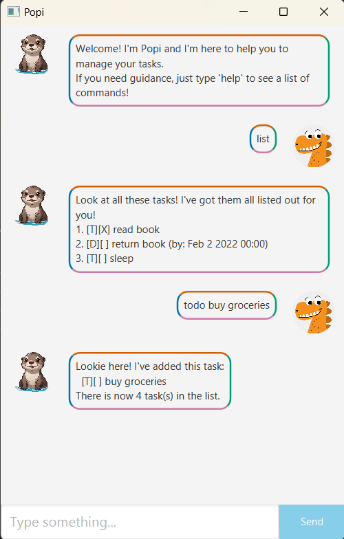

# Popi User Guide



Popi is a task manager that helps you to organize and keep track of your tasks.
Featuring a futuristic personality, Popi engages users with sophisticated and friendly interactions 
to make task management more enjoyable.
Popi is designed to be simple and easy to use.

## Getting Started

To launch Popi, simply run the following command from the terminal:

```
java -jar popi.jar
```

Popi will greet you with a welcome message and will be ready to take commands.

## Task Management

Popi can helps you:
- [x] Add tasks (Todo, Deadline, Event)
- [x] Mark tasks as done and unmark tasks
- [x] Delete tasks
- [x] List all tasks
- [x] Find tasks by keyword

> **Tip:**
>To view the list of available commands, type `help` and press `Enter`.

## Command Summary

### Add a task using `todo`, `deadline`, or `event`
Add a Todo task:
```
todo <task description>
e.g. todo read book
```

Add a Deadline task:
```
deadline <task description> /by <date>
e.g. deadline return book /by 2021-09-30 1800
```

Add an Event task:
```
event <task description> /from <date> /to <date>
e.g. event project meeting /from 2021-09-30 1400 /to 2021-09-30 1600
```

### List all tasks using `list`
List all tasks in the task list
```
list
```

### Mark a task as done using `mark` and unmark a task using `unmark`
Mark a task as done:
```
mark <task number>
e.g. mark 1
```

Unmark a task:
```
unmark <task number>
e.g. unmark 1
```

### Delete a task using `delete`
Delete a task by task number:
```
delete <task number>
e.g. delete 1
```

### Find tasks using `find`
Find tasks by keyword:
```
find <keyword>
e.g. find book
```
It will list all tasks that contain the keyword.

### Help using `help`
View the list of available commands:
```
help
```

### Exit the application using `bye`
Exit the application:
```
bye
```

## Conclusion
With Popi, managing your tasks is not only efficient but also enjoyable. 
Get started today and let Popi take your productivity to the next level!

## Acknowledgements
The following classes and and files in this project have been obtained or modified from the JavaFX tutorial provided by SE-EDU guides:

- Classes:
    - `Main.java`
    - `MainWindow.java`
    - `DialogBox.java`
    - 'Launcher.java'

- FXML Files:
    - `MainWindow.fxml`
    - `DialogBox.fxml`

For more information, visit the [JavaFX tutorial](https://se-education.org/guides/tutorials/javaFx.html).


